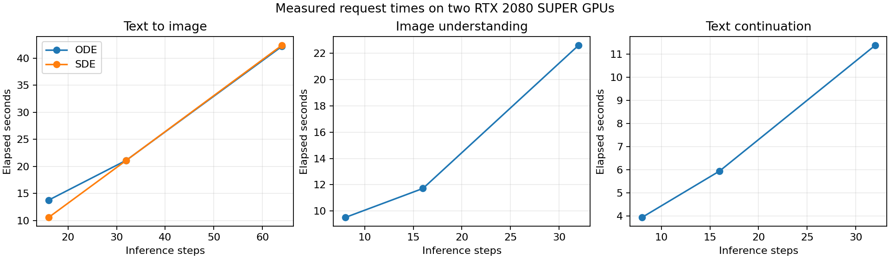
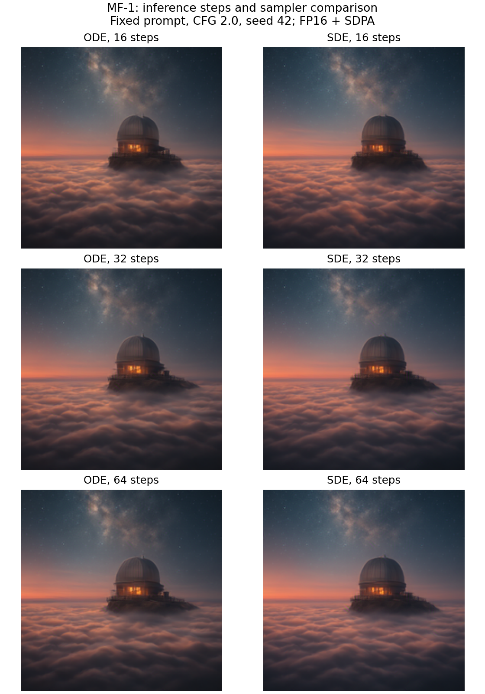

# MF-1 real-model experiments on two RTX 2080 SUPER GPUs

Author: sahil kumar — sahilkumar0910190@gmail.com<br>
Experiment date: 6 October 2026 (Asia/Karachi)<br>
Repository: https://github.com/wadhwanisahil/mf1-gradio-demo<br>
Initial revision: `ac65759dac0b2b14c3dc9c04062c2e9872e439a9` (main, initially clean). The commit containing this report includes the tested compatibility changes.

## Result and scope

Real official MF-1 SFT EMA weights successfully performed text-to-image, image understanding, and text continuation on the available workstation. All 14 controlled experiments, all four public inference endpoints, and all four browser tabs passed. Automated tests: 20 passed, including actual transfers between the two GPUs. No experiment uses the mock backend.

This study validates execution, resource use, controlled parameter changes, and output repeatability. It does not reproduce the paper's dataset benchmarks or establish numerical/quality parity with the official native-BF16 configuration. Text outputs contain grammatical errors, repetition, and incomplete sentences; a successful request does not establish perfect output quality.

## Hardware and software

| Item | Measured configuration |
| --- | --- |
| Operating system | Native Ubuntu 24.04.4 LTS, Linux 6.8.0-107-generic |
| CPU / RAM | Intel Xeon W-2223 @ 3.60 GHz, 4 cores / 8 threads; approximately 62 GiB reported RAM (64 GB installed) |
| Physical GPU 0 | NVIDIA GeForce RTX 2080 SUPER, 8192 MiB dedicated VRAM, compute capability 7.5 |
| Physical GPU 1 | NVIDIA GeForce RTX 2080 SUPER, 8192 MiB dedicated VRAM, compute capability 7.5 |
| Driver | 580.126.09 |
| CUDA driver compatibility / Torch runtime | 13.0 / 12.6; these are different values |
| Python | 3.11.16 |
| PyTorch / Torchvision / Triton | 2.8.0+cu126 / 0.23.0+cu126 / 3.4.0 |
| Transformers / Hugging Face Hub | 4.57.1 / 0.36.2 |
| Gradio / Gradio client | 6.17.3 / 2.5.0 |
| NumPy / Pillow / PyArrow | 2.3.1 / 10.4.0 / 20.0.0 |
| Pydantic / safetensors | 2.11.7 / 0.5.3 |
| AnyIO / effective typing_extensions | 4.14.2 / 4.16.0 |

No RTX 3090 or RTX 3060 is installed. PyTorch exposes approximately 7.6 GiB per card; the dedicated memory measurements come from `nvidia-smi`, not shared system RAM. Two cards do not become a single 16 GiB CUDA device. GPU UUIDs and full package versions are preserved in [validation](validation/). `pip freeze` records the editable package's initial Git revision and the local Torch wheel URLs; the source containing this report is the tested implementation. The RAM package target shadows the environment's typing_extensions 4.15.0 with 4.16.0; `pip check` passes. The durable compatibility YAML retains the official 4.15.0 pin.

## Model assets and compatibility method

Required SFT model, shared text decoder, vision statistics, and Scale RAE decoder were downloaded with `gradio_demo/scripts/download_assets.py`. T5-small and SigLIP2 encoder assets were subsequently downloaded by the official loaders. No training datasets or other MF checkpoints were downloaded.

| Asset | Provenance |
| --- | --- |
| hustvl/Multimodal-Flow revision | `13818c6b12c6ac1876a84ecf59f1d6779acc18e2` |
| MF model.safetensors SHA256 | `2f3a3531ee85307313b55b802db62ceda028e1c7de7d9baf739b7e18ce8c6013` |
| nyu-visionx/siglip2_decoder revision | `4a728df72b21ff7ec1d81b4235047c1731b0edae` |
| Scale RAE model.pt SHA256 | `ca7e6b907bb51455a12eea39b6acb1999c2133f325c123cda20ceb206d1ef3cb` |
| t5-small encoder revision | `df1b051c49625cf57a3d0d8d3863ed4d13564fe4` |
| google/siglip2-so400m-patch14-224 encoder revision | `78e403963a4f6a3640d07803284752326fdf4edf` |

BF16 and FP16 are both 16-bit floating-point formats. BF16 has a wider exponent range, similar to FP32, while FP16 has a narrower range and more fractional precision. These Turing GPUs support FP16 but lack native BF16. Simply changing all tensors to FP16 can overflow, particularly in encoders.

The opt-in implementation converts the backbone's BF16 parameters to FP16 in memory, preserves FP32 boundaries/statistics, and runs encoders and the image decoder in FP32 on GPU 1. MF remains on GPU 0, with explicit codec input/output transfers. The checkpoint, architecture, samplers, and text decoder remain real MF-1. The default BF16 path remains available.

A real compiled FlexAttention FP16 probe failed on this GPU with a Triton shared-memory/configuration error. The compatibility path uses PyTorch SDPA with the exact original MF chunk visibility mask. Tests independently verify packed sequence isolation and the official noisy text block mask; ordinary causal attention would not preserve this behavior. Non-finite predictions and images fail explicitly before conversion. Gradio 6.29.1 conflicted with the official Hub pin; installing 6.17.3 resolves that dependency conflict.

## Experimental design

Image prompt: “A quiet observatory above the clouds, cinematic moonlight.” Image output: 224 × 224. ODE and SDE were compared at 16, 32, and 64 flow steps, CFG 2.0, seed 42. SDE at 64 steps was repeated with seed 42 and compared against seed 43.

Caption input: repository `docs/assets/astronaut.png`. Instruction: “Describe this image in detail.” Caption and continuation were each compared at 8, 16, and 32 flow steps, target length 64, CFG 2.0, seed 42. Continuation prefix: “Continuous multimodal representations make it possible to”. The mandatory smoke test separately used the script's default text length 128, 16 text steps, and 64 image steps.

Requests were serialized. Timings are synchronized backend request times, including lazy codec initialization where applicable. They exclude model construction and task-switch cleanup before the request timer, which are not part of these inference timings. Model loads use already downloaded local assets; they are not download timings. This is one request per condition, with one image repeat, so no confidence intervals or statistical significance claims are made.

## Measurements

Final smoke model load: **20.31 seconds**. Separate experiment/application loads: **20.70 / 19.99 seconds**.

| Mandatory smoke path | Request time (s) | Peak Torch allocated GPU 0 / GPU 1 (GiB) |
| --- | --- | --- |
| Text-to-image, SDE 64 | 44.69 | 3.44 / 1.71 |
| Image understanding, length 128, 16 steps | 25.88 | 3.63 / 1.75 |
| Text continuation, length 128, 16 steps | 12.84 | 3.27 / 0.14 |

All four required artifacts exist in [smoke](smoke/): `text_to_image.png`, `image_understanding.txt`, `text_continuation.txt`, and `report.json`. GPU sampling accompanies the outputs.

| Experiment | Steps | Request time (s) | Result |
| --- | --- | --- | --- |
| image_ode_16_seed42 | 16 | 13.77 | passed |
| image_sde_16_seed42 | 16 | 10.57 | passed |
| image_ode_32_seed42 | 32 | 21.14 | passed |
| image_sde_32_seed42 | 32 | 21.13 | passed |
| image_ode_64_seed42 | 64 | 42.18 | passed |
| image_sde_64_seed42 | 64 | 42.38 | passed |
| image_sde_64_seed43 | 64 | 42.19 | passed |
| image_sde_64_seed42_repeat | 64 | 42.29 | passed |
| caption_8_seed42 | 8 | 9.51 | passed |
| caption_16_seed42 | 16 | 11.72 | passed |
| caption_32_seed42 | 32 | 22.6 | passed |
| text_8_seed42 | 8 | 3.94 | passed |
| text_16_seed42 | 16 | 5.95 | passed |
| text_32_seed42 | 32 | 11.38 | passed |

Image latency roughly doubles as steps double in the warm runs. The first ODE-16 request includes lazy codec initialization, so its time is not a clean ODE/SDE performance comparison. Text step counts also increase latency. More steps did not consistently improve the caption's grammar in this small comparison.



The experiment monitor sampled at 0.5-second intervals. Observed whole-device peaks: **4024 MiB on GPU 0 and 2757 MiB on GPU 1**; utilization peaks: **93% / 41%**. Final smoke sampled peaks: **3886 / 2523 MiB**. Sampled peaks can miss short spikes and include desktop/other processes. Torch allocated peaks measure a different scope and exclude the CUDA context, reserved cache, and non-Torch allocations. Raw samples are included in each `gpu.csv`.

## Output inspection and repeatability

The generated images visibly contain an observatory dome above clouds and a starry sky. Lighting often appears as orange twilight, and there is no clear moon in the baseline: prompt adherence is partial. Different samplers/step counts change details, with no objective image quality score assigned.

The unconditional-image endpoint produces a coherent image of a person on a city street. Its shirt lettering is imperfect, a further observed image-generation limitation.



The 16-step caption correctly identifies an astronaut in a white suit against dark space: “The image depicts an astronaut wearing a white space suit, floating in the blackness of space. The astronaut is”. It ends mid-sentence. The 8- and 32-step captions include less coherent details; full unedited text is preserved. Continuations discuss multimodal data and follow the prefix, but show repetition, errors such as “graphural,” and truncation at the configured length. These observations remain limitations, not silently edited outputs.

The repeated SDE-64 seed-42 output has identical pixel SHA256 (`a33aa846d78a57467132e6c5fce59130e468dd349dbf1232a7d8c0ca2ab7ad25`). The final post-fix smoke image matches that baseline pixel-for-pixel. The lossless PNG API output also matches the direct SDE-32 experiment's pixels exactly. Seed 43 produces a different image. This demonstrates repeatability on this host/configuration; it does not guarantee identical results across devices, precisions, or software versions.

## Gradio and automated verification

| Live endpoint | Request time (s) | Result |
| --- | --- | --- |
| /generate_image | 25.31 | passed |
| /generate_unconditional | 12.76 | passed |
| /analyze_image | 15.26 | passed |
| /continue_text | 7.02 | passed |

The checker requires `mode=real`, `loaded=true`, real task metadata, seed 42, positive GPU allocation evidence, and valid image/nonempty text output. It saves [endpoint evidence](endpoints/). All three task buttons were also exercised in Chrome through the rendered browser interface, including an actual file upload. The System information tab showed the real FP16/SDPA configuration. All four tabs passed with no browser page errors; [screenshots and report](browser/) are preserved. The submission archive additionally includes the browser video. Browser testing exposed a Gradio Examples/Dataset JavaScript exception; replacing the two prompt galleries with dropdowns that populate the same text inputs eliminated that failure.

Browser testing also exposed an untouched optional stop-sequence field arriving as `None`. The backend now treats that as no stop sequences; a regression test covers unset, empty, and multiline values, and the live endpoint checker sends `None` to exercise the same case. The output image component uses lossless PNG serialization, and the API checker writes actual PNG files. Smoke and endpoint checks were rerun after the browser fixes. The 14-condition matrix predates these UI/input fixes; its model settings and numerical implementation are unchanged.

Automated verification: **20/20 tests passed**, no skips on this two-GPU host; Ruff checks for `src` and `gradio_demo` passed; demo formatting passed (17 files); compilation passed; `pip check` passed. Preflight: **13 PASS, 0 FAIL**, with two deliberate warnings for experimental FP16 and low VRAM. Test logs contain two Gradio event-loop ResourceWarnings; live Gradio emits a Starlette deprecation warning. These did not prevent inference.

## Reproduction commands and storage

Full effective runtime variables are in [runtime.env](validation/runtime.env), and package versions in [packages-real.txt](validation/packages-real.txt). Run from the repository root. The commands below were used for the completed real validation (log redirections omitted):

```bash
nvidia-smi
nvidia-smi --query-gpu=index,name,uuid,memory.total,driver_version --format=csv
source outputs/current-host-validation/runtime.env
/tmp/mf1-validation-env/bin/python gradio_demo/scripts/download_assets.py --model-root /dev/shm/mf1-models/MF_weights --assets-root /dev/shm/mf1-models/assets
/tmp/mf1-validation-env/bin/python gradio_demo/scripts/preflight.py --json
/tmp/mf1-validation-env/bin/python -m unittest discover -s gradio_demo/tests -v
/tmp/mf1-validation-env/bin/ruff check src gradio_demo
/tmp/mf1-validation-env/bin/ruff format --check gradio_demo
/tmp/mf1-validation-env/bin/python -m compileall -q src gradio_demo
/tmp/mf1-validation-env/bin/python -m pip check
/tmp/mf1-validation-env/bin/python gradio_demo/scripts/smoke_test.py --checkpoint "$MF_CHECKPOINT" --assets-root "$MF_ASSETS_ROOT" --output-dir outputs/mf1-smoke
/tmp/mf1-validation-env/bin/python gradio_demo/scripts/experiments.py
/tmp/mf1-validation-env/bin/python gradio_demo/app.py --host 127.0.0.1 --port 7860
# Run these against the running app in another terminal:
/tmp/mf1-validation-env/bin/python gradio_demo/scripts/test_endpoints.py
/tmp/mf1-validation-env/bin/python outputs/current-host-validation/browser_validation.py
git diff --check
```

Because only approximately 8 GiB disk space was initially free, CUDA wheels/libraries and assets were placed in `/dev/shm` (RAM). The Python environment is `/tmp/mf1-validation-env`, and the CUDA package target is `/dev/shm/mf1-python`. Model assets are `/dev/shm/mf1-models`, and encoder cache is `/dev/shm/mf1-hf-cache`. `/dev/shm` held approximately 16 GiB during validation. The CUDA libraries were installed from a downloaded Torch 2.8.0+cu126 wheel and matching dependencies into that target; see installation logs in the submission archive. No preexisting user environment or files were removed.

**RAM assets/packages disappear on reboot; `/tmp` may also be cleared.** The small evidence files and this report are stored persistently in the checkout. For a durable installation with sufficient disk space, use these reproducible setup commands (the tested host used the temporary split installation above):

```bash
conda env create -f gradio_demo/environment-compat.yaml
conda activate multimodal-flow-compat
python gradio_demo/scripts/download_assets.py --model-root "$PWD/MF_weights" --assets-root "$PWD/assets"
export MF_CHECKPOINT="$PWD/MF_weights/MF/sft"
export MF_ASSETS_ROOT="$PWD/assets"
export CUDA_VISIBLE_DEVICES=0,1
export MF_DEVICE=cuda:0
export MF_CODEC_DEVICE=cuda:1
export MF_PRECISION=fp16
export MF_ATTENTION_BACKEND=sdpa
export MF_ALLOW_LOW_VRAM=1
export MF_MOCK=0
python -m pip check
python gradio_demo/scripts/preflight.py
```

For a professor's Ampere-or-newer GPU with sufficient VRAM, follow the default environment instructions in `gradio_demo/README.md`, clear the compatibility overrides, and repeat smoke/experiments/API validation in BF16. That configuration has not been measured in this report.

## Remaining limitations and publication

The compatibility implementation is experimental, requires explicit flags, and has no measured BF16 parity. Evidence covers one caption image and one image/text prompt family, 224-pixel image output, and limited text lengths; larger workloads may use more memory. No FID, CLIP score, BLEU, dataset accuracy, training experiment, or official benchmark reproduction is claimed. CPU codec offload is implemented but not benchmarked here. Default BF16/FlexAttention behavior on a newer GPU still requires validation by the professor.

The existing `main` branch contains the tested source and this report after local commit. GitHub publication depends on authentication on this workstation. Consult the submission archive's `git-publication.json` for the exact final commit and push result; a local commit must not be confused with a pushed commit. A Git bundle is supplied for offline transfer if GitHub authentication is unavailable.
